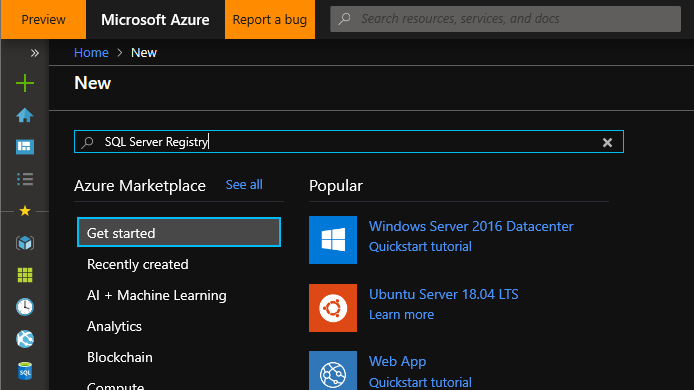
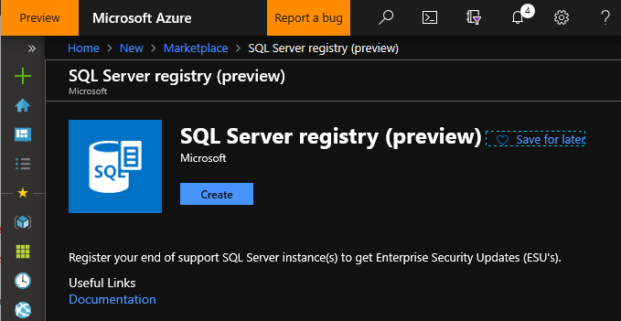
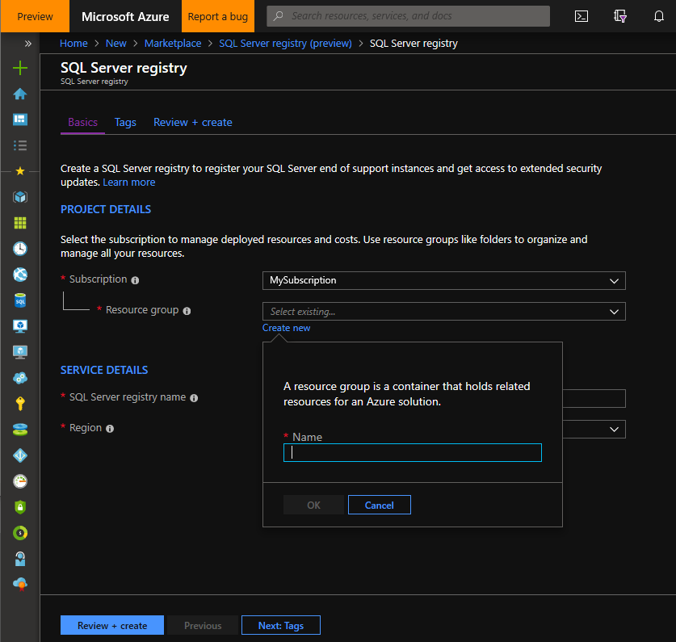
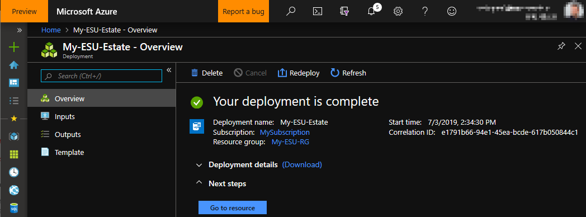
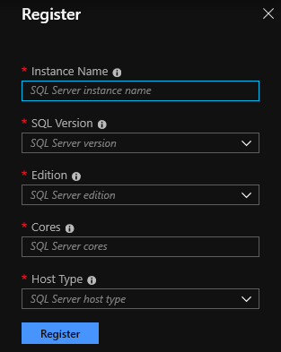
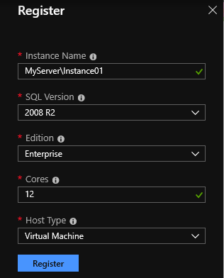
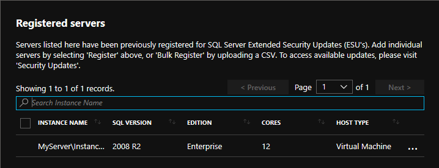
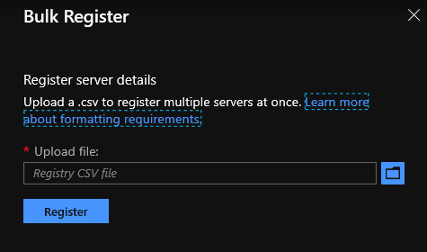
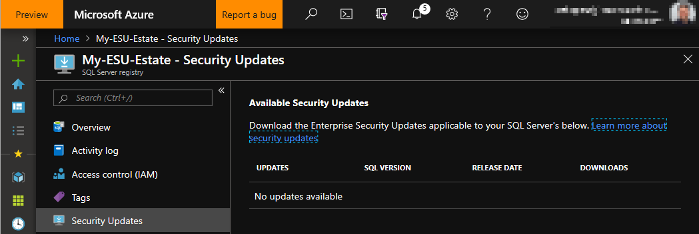

# SQL Server 2008/2008 R2 Extended Security Updates (ESUs)
SQL Server 2008 and SQL Server 2008 R2 have reached the end of their support lifecycle on July 9, 2019. 
Each version is backed by a minimum of 10 years of support (5 years for Mainstream Support and 5 years for Extended Support) including regular security updates. 
End of support means the end of security updates, which can cause security and compliance issues and put applications and business at risk. 
We recommend upgrading to current versions for the most advanced security, performance, and innovation. 

For customers that couldn’t get all servers upgraded by the deadline, new options help protect applications and data during the upgrade transition:
-  Migrate your existing SQL Server 2008 and 2008 R2 workloads as-is to Azure Virtual Machines, and receive additional three years of free Extended Security Updates (if and when available)
-  Purchase Extended Security Updates for your servers and remain protected for up to three years until you are ready to upgrade to a newer SQL Server version
Microsoft recommends applying Extended Security Update patches as soon as they are available to keep their environment protected.

---

## Table of Contents

-  [Useful links](#Useful-links)
-  [What are Extended Security Updates for SQL Server](#What)
-  [Prepare to register SQL Server instances](#Reg)
-  [Register a single SQL Server instance](#RegSingle)
-  [Bulk register SQL Server instances](#RegBulk)
   -  [Formatting requirements for a CSV file](#csv)
-  [How to download Extended Security Updates](#Download)
-  [Script examples](#Script-examples)
   -  [T-SQL script example](#tsql)
   -  [Powershell script examples](#ps)

---

## Useful links
- [SQL Server 2008/2008R2 end of support page](https://aka.ms/sqleos)     
- [Extended Security Updates frequently asked questions](https://aka.ms/sqleosfaq)    
- [Microsoft Security Response Center (MSRC)](https://portal.msrc.microsoft.com/security-guidance/summary)

---

## <a name="What"></a> What are Extended Security Updates for SQL Server

Extended Security Updates (ESUs) include provision of Security Updates rated **Critical** by [MSRC](https://portal.msrc.microsoft.com/security-guidance/summary).    

ESUs will be distributed if and when available, and do not include:
-  New features
-  Customer-requested non-security hotfixes
-  Design change requests    

### Support
ESUs do not include technical support, but customers can use an active support contract such as Software Assurance or Premier/Unified Support on SQL Server 2008 / 2008 R2 to get technical support on workloads covered by ESUs if they choose to stay on-premises. Alternatively, if hosting on Azure, customers can use an Azure Support plan to get technical support.

### ESU Availability
**In Azure:** Customers who migrate workloads to Azure Virtual Machines (IaaS) will have access to Extended Security Updates for SQL Server 2008 and 2008 R2 for three years after the End of Support dates for **no additional charges** above the cost of running the virtual machine. Customers do not need Software Assurance to receive Extended Security Updates in Azure.

**On-premises or hosted environments:** Software Assurance customers can purchase Extended Security Updates for three years after End of Support date, under an Enterprise Agreement (EA), Enterprise Subscription Agreement (EAS), a Server & Cloud Enrollment (SCE), or an Enrollment for Education Solutions (EES). Customers can purchase Extended Security Updates only for the servers they need to cover. Extended Security Updates can be purchased directly from Microsoft or a Microsoft licensing partner.

For more information, refer to the [Extended Security Updates frequently asked questions](https://aka.ms/sqleosfaq).

### ESU Delivery
**Azure Virtual Machines:** Customers will receive updates automatically through existing SQL Server update channels, whenever vulnerabilities are found, and rated **Critical** by MSRC. If an Azure Virtual Machine is not configured to receive automatic updates, then the on-premises download option applies.

**On-premises or hosted environments:** Customers that buy Extended Security Updates will be able to [register the eligible instances](#Reg) and download updates from the Azure Portal to deploy to their on-premises or hosted environments, whenever vulnerabilities are found, and rated **Critical** by MSRC. This is also the process that customers will need to follow for Azure Stack and Azure Virtual Machines that are not configured to receive automatic updates.

---

## <a name="Reg"></a> Prepare to register SQL Server instances
Before being able access the Extended Security Updates (ESU) download area in the Azure portal, the SQL Server instances covered by ESUs must be registered. This ensures that you are able to download an ESU package if and when available.

To register SQL Server instances, you must first create a SQL Server Registry in the [Azure portal](https://portal.azure.com).

1. Open the [Azure portal](https://portal.azure.com) and log in.

2. If this is your first time registering a SQL Server instance, click the plus (+) sign in the top-left area of the page to create a new resource. Then type *SQL Server Registry* in the text box and hit the **Enter** key.

     

3. The SQL Server Registry resource should be available. Click on it begin the Registry setup process.

     

4. After selecting the SQL Server Registry resource, click on the *Create* button.

     

5. In the **PROJECT DETAILS** section, select the ***subscription*** on which to create the Registry. Then, select either an existing ***Resource group***, or create a new one.

     

   In the **SERVICE DETAILS** section, enter a name for the ***SQL Server registry***, and select a ***Region*** on which to deploy this new resource.

     

    And then click on the ***Review + create*** button.

6. If the validation passed, you are presented with a screen that summarizes the choices for the new registry resource. If everything seems correct, click on the ***Create*** button to start deployment of the new resource.

     

7. Once deployment is complete, click on the ***Go to resource*** button.

     

     

8. Now the **SQL Server Registry** is available for you to start registering SQL Server instances.

     

---

## <a name="RegSingle"></a> Register a single SQL Server instance

1. To register a new SQL Server instance, click the ***+ Register*** button in the top bar.

     

2. Enter the required information as seen below:
   -  **Instance Name:** enter the output of running the command `SELECT @@SERVERNAME` or `SELECT SERVERPROPERTY('ServerName')`
   -  **SQL Version:** select from the drop-down the applicable version
      - 2008
      - 2008 R2
   -  **Edition:** select from the drop-down the applicable edition
      - Datacenter
      - Developer (free to deploy if purchased ESUs)
      - Enterprise
      - Standard
      - Web
      - Workgroup 
   -  **Cores:** enter the number of cores for this instance
   -  **Host Type:** select from the drop-down the applicable environment
      - Virtual Machine (on-premises)
      - Physical Server (on-premises)
      - Azure Virtual Machine (includes Azure Stack and VMWare on Azure)
      - Amazon EC2
      - Google Compute Engine
      - Other


     

    If registering an Azure Virtual Machine (VM), additional information is required to complete registration:
    -  **Subscription Id:** enter the subscription ID on where the VM is created
    -  **Resource Group:** enter the resource group on where the VM is created
    -  **Azure VM Name:** enter the VM resource name
    -  **Azure VM Operating System:** select from the drop-down the applicable Windows Server version

3. When all fields are populated, click the ***Register*** button to complete registration.

     

4. The newly registered instance will be available in the ***Registered servers*** section of the page.

     

---

## <a name="RegBulk"></a> Bulk register SQL Server instances 

1. To bulk register new SQL Server instances, click the ***↑ Bulk Register*** button in the top bar.

    

2. Click the folder icon to search for a previously prepared CSV file that contains all the required information to register SQL Server instances. Once selected, click the ***Register*** button.

     

3. The newly registered instance(s) will be available in the ***Registered servers*** section of the page.

### <a name="csv"></a> Formatting requirements for CSV file

The CSV file **must** be generated with the following format:
-  Values are comma separated
-  Values are not single or double-quoted
-  Column names must be camelCase and precisely named as seen below:
   - name
   - version
   - edition
   - cores
   - hostType
   - subscriptionId <sup>1</sup>
   - resourceGroup <sup>1</sup>
   - azureVmName <sup>1</sup>
   - azureVmOS <sup>1</sup>

<sup>1</sup> Only for Azure Virtual MAchine registrations

> [!TIP]    
> Use the Powershell [script examples](#Script-examples) to generate the required CSV files.

#### CSV Example 1 - on-premises

```
name,version,edition,cores,hostType    
Server1\SQL2008,2008,Enterprise,12,Physical Server    
Server1\SQL2008 R2,2008 R2,Enterprise,12,Physical Server    
Server2\SQL2008 R2,2008 R2,Enterprise,24,Physical Server    
Server3\SQL2008 R2,2008 R2,Enterprise,12,Virtual Machine    
Server4\SQL2008,2008,Developer,8,Physical Server  
```

Refer to [MyPhysicalServers.csv](./scripts/MyPhysicalServers.csv) for a CSV file example.

#### CSV Example 2 - Azure VM

```
name,version,edition,cores,hostType,subscriptionId,resourceGroup,azureVmName,azureVmOS    
ProdServerUS1\SQL01,2008 R2,Enterprise,12,Azure Virtual Machine,61868ab8-16d4-44ec-a9ff-f35d05922847,RG,VM1,2012    
ProdServerUS1\SQL02,2008 R2,Enterprise,24,Azure Virtual Machine,61868ab8-16d4-44ec-a9ff-f35d05922847,RG,VM1,2012    
ServerUS2\SQL01,2008,Enterprise,12,Azure Virtual Machine,61868ab8-16d4-44ec-a9ff-f35d05922847,RG,VM2,2012 R2    
ServerUS2\SQL02,2008,Enterprise,8,Azure Virtual Machine,61868ab8-16d4-44ec-a9ff-f35d05922847,RG,VM2,2012 R2    
SalesServer\SQLProdSales,2008 R2,Developer,8,Azure Virtual Machine,61868ab8-16d4-44ec-a9ff-f35d05922847,RG,VM3,2008 R2   
```

Refer to [MyAzureVMs.csv](./scripts/MyAzureVMs.csv) for an Azure VM targetted CSV file example.

---

## <a name="Download"></a> How to download Extended Security Updates

1. To download a security update that is made available throughout the three years of the ESU program, click ***Security Updates***.
   - All available ESU packages available per version will be listed
   - A ***Download*** button will appear inline with each available update package, allowing customers to download, to later install in the eligible SQL Server instances.

     

##  Script examples

### <a name="tsql"></a> T-SQL
To collect data from a single instance, you can use the example T-SQL script [EOS_DataGenerator_SingleInstance.sql](./scripts/EOS_DataGenerator_SingleInstance.sql) below:

```sql
DECLARE @SystemManufacturer NVARCHAR(128), @Edition NVARCHAR(20), @HostType NVARCHAR(30), @Cores int, @SQLVersion NVARCHAR(50)
DECLARE @machineinfo TABLE ([Value] NVARCHAR(256), [Data] NVARCHAR(256))

INSERT INTO @machineinfo
EXEC xp_instance_regread 'HKEY_LOCAL_MACHINE','HARDWARE\DESCRIPTION\System\BIOS','SystemManufacturer';
SELECT @SystemManufacturer = [Data] FROM @machineinfo WHERE [Value] = 'SystemManufacturer';
SET @HostType = 'Physical Server'
IF LOWER(@SystemManufacturer) = 'microsoft' OR LOWER(@SystemManufacturer) = 'vmware'
SET @HostType = 'Virtual Machine'

SELECT @Cores = hyperthread_ratio FROM sys.dm_os_sys_info;
SELECT @Edition = CONVERT(NVARCHAR(20), SERVERPROPERTY('Edition'))
SELECT @SQLVersion = CONVERT(NVARCHAR(50), SERVERPROPERTY('ProductVersion'))

SELECT SERVERPROPERTY('ServerName') AS [name],  
	CASE LEFT(@SQLVersion,4) WHEN '10.0' THEN '2008'
		WHEN '10.5' THEN '2008R2'
		WHEN '11.0' THEN '2012'
		WHEN '12.0' THEN '2014'
		WHEN '13.0' THEN '2016'
		WHEN '14.0' THEN '2017'
		WHEN '15.0' THEN '2019'
		ELSE 'Other'
		END AS [version], 
	LEFT(@Edition,CHARINDEX(' ', @Edition,0)-1) AS edition,
	@Cores AS cores,
	@HostType AS hostType;
```
> [!NOTE]    
> Verify if the **Host Type** is correct for your SQL Server instance.

### <a name="ps"></a> Powershell

To collect data from all instances in a single machine, you can use the example Powershell script [EOS_DataGenerator_LocalDiscovery.ps1](./scripts/EOS_DataGenerator_LocalDiscovery.ps1). Can be used in an Azure VM, on-premises physical server or on-premises VM. 

> [!NOTE]    
> Verify if the **Host Type** is correct for your SQL Server instance before uploading the CSV file.

To collect data from all instances listed in a text file, you can use the example Powershell script [EOS_DataGenerator_InputList.ps1](./scripts/EOS_DataGenerator_InputList.ps1). Refer to [ServerInstances.txt](./scripts/ServerInstances.txt) for an input text file example.

> [!NOTE]    
> Verify if the **Host Type** is correct for your SQL Server instance before uploading the CSV file.